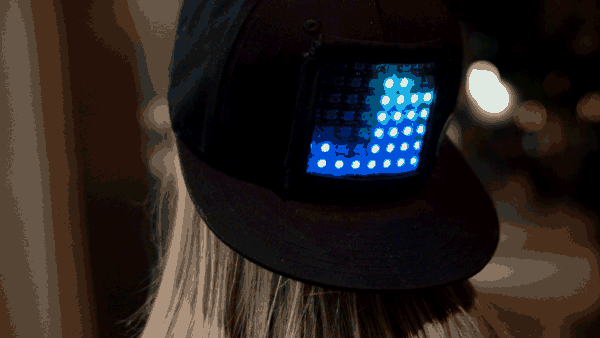

# Animatable-LED-Hat
Battery operated, LED matrix hat that can be programmed to display interesting designs.

## Demo and Build Instructions
Click the gif for a link to the video or read the [full writeup]() for this project on hackster.io

[](https://www.youtube.com/channel/UCEcNXmr7DYq1XxpWHSxaN0w)

## Setup Guide
In order to upload the code to your board, make sure you've completed the following steps:

Open the `led_hat.ino` file from the `led_hat` folder with the Arduino IDE.

Add the Adafruit AVR boards through the board manager. This [Adafruit guide](https://learn.adafruit.com/add-boards-arduino-v164/setup) shows you how to install support for AVR boards. 

Install the `Adafruit Neopixel` library through the Library Manager (`Sketch -> Include Library-> Manage Libraries...`). I used version 1.0.6, but newer versions should work as well.

Make sure you select the correct board port under the `Tools` menu. I selected `Tools-> Board: Adafruit Flora` and `Tools-> Port -> /dev/{some port with usb}`

Click `Upload` to upload the code on your board. 

If the code fails to upload on your board, try switching the port in the tools menu.

## Modifying the Code

All of the animation functions are called in the main loop at the end of the file (`void loop()`). You can add or remove functions here to display different effects. 

### Function List

#### drawShape
```
void drawShape(byte shape[], uint32_t color, boolean flash, int cycles, int delayTime) {
```

Displays a shape of the selected color on the matrix. In general, shapes are loaded onto the LED matrix through byte arrays. At the top of the program, I have a couple predefined shapes. Each row corresponds to a byte in the array. A value of 1 means the pixel should be on, 0 means it should be off. Each byte is loaded in from the bottom to the top and from the right side to the left. Therefore, a byte array with the value `byte arr[] = {B10000000, B10000000, B10000000, B10000000, B10000000, B10000000, B10000000, B10000000};` will have lit pixels only on the rightmost column.

- `uint32_t color` is an RGB color value.
- `boolean flash` flashes the shape.
- `int cycles` number of times to loop the shape.
- `int delayTime` delay between cycles in MS.

#### rainbowShape
```
void rainbowShape(byte shape[], uint8_t wait)
```
Similar to drawShape, but will add a rainbow animation.

#### twoColor
```
void twoColor(byte shape[], uint32_t color1, uint32_t color2, int cycles, int delayTime)
```
Similar to `drawShape`, but all pixels are lit. 1s will be `color1`, 0s will be color2.

#### animate
```
void animate(byte shape[][8], int frames, uint32_t color, int cycles, int delayTime)
```

Similar to `drawShape`, but this function displays an animated design. Instead of passing in a single byte array, you can pass in multiple byte arrays that will display sequentially. 

- `int frames` the number of arrays in your 2d byte array.
- `uint32_t color` an RGB color value for every frame.
- `int cycles` number of times to loop the animation.
- `int delayTime` delay between cycles in MS.

#### rainbowAnimate
```
void rainbowAnimation(byte shape[][8], int frames, int cycles, int delayTime)
```
Similar to `animate`, but changes the color for each frame. 
